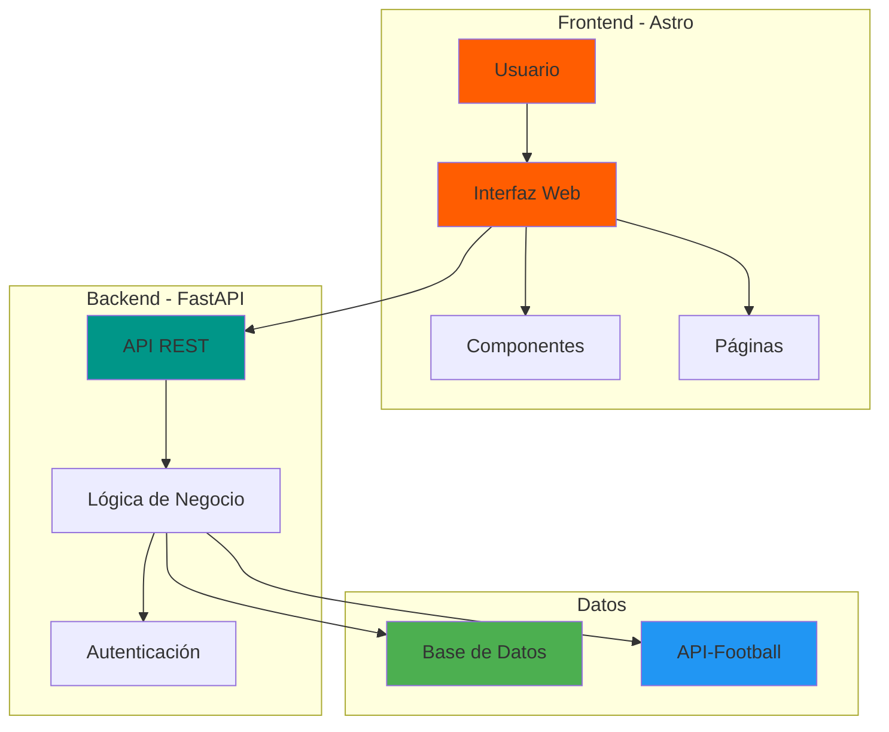
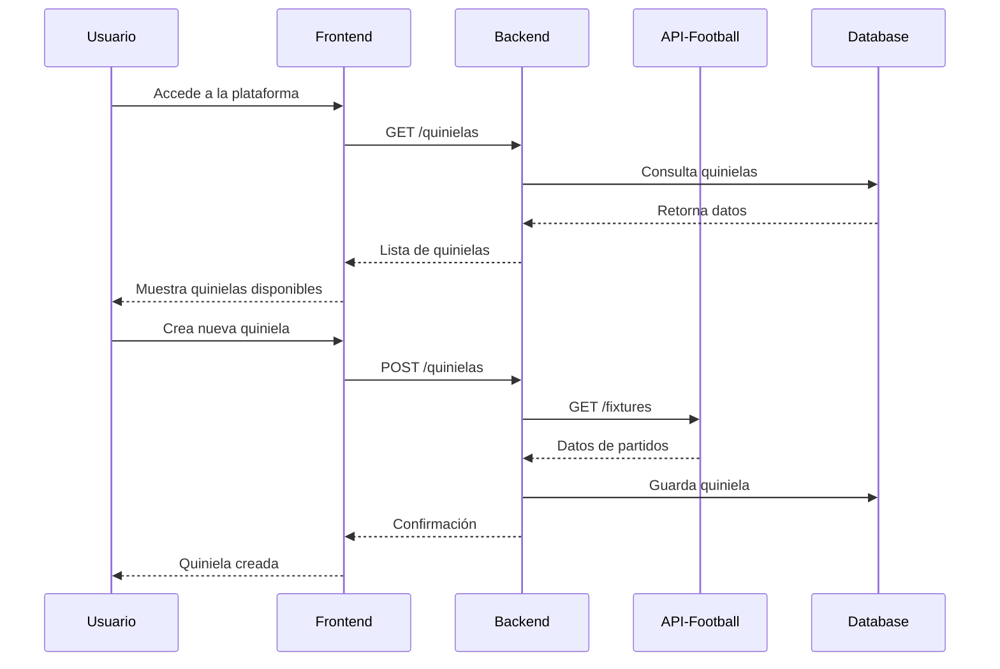
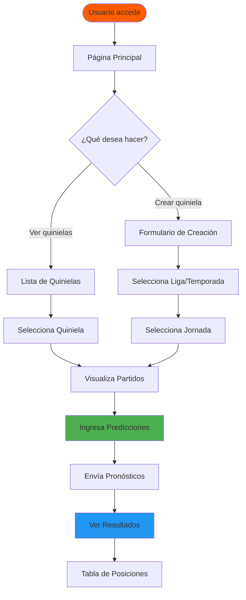

<div align="center">

# 🏆 Quiniela Frontend

### Plataforma web para crear y participar en quinielas deportivas

[](https://astro.build)
[](https://developer.mozilla.org/en-US/docs/Web/JavaScript)
[](https://developer.mozilla.org/en-US/docs/Web/CSS)

---

</div>

## 📋 Tabla de Contenidos

- [Descripción](#-descripción)
- [Características](#-características)
- [Tecnologías](#-tecnologías)
- [Arquitectura del Sistema](#-arquitectura-del-sistema)
- [Estructura del Proyecto](#-estructura-del-proyecto)
- [Instalación](#-instalación)
- [Comandos Disponibles](#-comandos-disponibles)
- [Flujo de Usuario](#-flujo-de-usuario)
- [API Integration](#-api-integration)
- [Roadmap](#-roadmap)
- [Autor](#-autor)

---

## 🎯 Descripción

**Quiniela Frontend** es una aplicación web moderna construida con Astro que permite a los usuarios crear y participar en quinielas deportivas. La plataforma consume datos de una API externa de deportes y se conecta con un backend FastAPI para gestionar toda la lógica de negocio.

Este proyecto se enfoca en proporcionar una experiencia de usuario fluida, rápida y visualmente atractiva para predecir resultados deportivos y competir con otros usuarios.

---

## ✨ Características

- 🎮 **Creación de Quinielas** - Crea quinielas personalizadas por liga y temporada
- 📊 **Visualización de Partidos** - Consulta partidos organizados por jornada
- 🔮 **Sistema de Predicciones** - Registra tus pronósticos de forma intuitiva
- 🏅 **Tablas de Posiciones** - Visualiza rankings y puntajes en tiempo real
- 🌐 **Quinielas Públicas/Privadas** - Participa en quinielas abiertas o crea las tuyas
- ⚡ **Rendimiento Optimizado** - Gracias a la arquitectura de Astro
- 📱 **Diseño Responsivo** - Funciona perfectamente en todos los dispositivos

---

## 🚀 Tecnologías

| Tecnología | Descripción |
|------------|-------------|
| **Astro** | Framework frontend moderno para sitios ultra-rápidos |
| **JavaScript/TypeScript** | Lenguajes de programación principal |
| **CSS3** | Estilos y diseño visual |
| **React** *(futuro)* | Para componentes interactivos avanzados |
| **FastAPI** | Backend REST API |
| **API-Football** | Fuente de datos deportivos |

---

## 🏗️ Arquitectura del Sistema


### Diagrama de Flujo de Datos


---

## 📁 Estructura del Proyecto
```
/
├── 📂 public/
│   └── favicon.svg              # Archivos estáticos
├── 📂 src/
│   ├── 📂 assets/               # Imágenes, íconos, fuentes
│   ├── 📂 components/           # Componentes reutilizables
│   │   ├── MatchCard.astro
│   │   ├── PredictionForm.astro
│   │   └── Leaderboard.astro
│   ├── 📂 layouts/              # Layouts base
│   │   └── MainLayout.astro
│   ├── 📂 pages/                # Rutas de la aplicación
│   │   ├── index.astro          # Página principal
│   │   ├── quinielas.astro      # Lista de quinielas
│   │   └── quiniela/
│   │       └── [id].astro       # Detalle de quiniela
│   └── 📂 styles/               # Estilos globales
│       └── global.css
├── astro.config.mjs             # Configuración de Astro
├── package.json                 # Dependencias
└── README.md                    # Este archivo
```

### 📂 Carpetas Clave

#### `pages/`
Define las rutas del sitio mediante file-based routing:
- `/` → Página principal
- `/quinielas` → Listado de quinielas
- `/quiniela/[id]` → Detalle de quiniela específica
- `/login`, `/register` *(futuro)*

#### `components/`
Componentes reutilizables:
- 🃏 **MatchCard** - Tarjetas de partidos
- 📝 **PredictionForm** - Formulario de predicciones
- 🏆 **Leaderboard** - Tabla de posiciones
- 🔘 **Button** - Botones personalizados
- 🎭 **Modal** - Componentes modales

#### `layouts/`
Layouts base para estructura consistente:
- Header
- Footer
- Navegación
- Contenedor principal

---

## 🔧 Instalación

### Prerequisitos

- Node.js (v18 o superior)
- npm o yarn

### Pasos de instalación
```bash
# Clonar el repositorio
git clone https://github.com/WilverEmilio/Quinela_frontend.git  

# Navegar al directorio
cd quiniela-frontend

# Instalar dependencias
npm install

# Iniciar servidor de desarrollo
npm run dev
```

La aplicación estará disponible en `http://localhost:4321`

---

## 🎮 Comandos Disponibles

| Comando | Acción |
|---------|--------|
| `npm install` | Instala todas las dependencias |
| `npm run dev` | Inicia servidor de desarrollo en `localhost:4321` |
| `npm run build` | Construye el sitio para producción en `./dist/` |
| `npm run preview` | Previsualiza la build de producción localmente |
| `npm run astro ...` | Ejecuta comandos CLI de Astro |
| `npm run astro check` | Verifica errores en el proyecto |

---

## 🎯 Flujo de Usuario


### Proceso detallado:

1. **Acceso** - El usuario ingresa a la plataforma
2. **Exploración** - Visualiza quinielas públicas o personales
3. **Creación** - Crea nueva quiniela seleccionando:
   - ⚽ Deporte
   - 🌍 País
   - 🏆 Liga
   - 📅 Temporada/Jornada
4. **Predicción** - Visualiza partidos e ingresa pronósticos
5. **Seguimiento** - Consulta resultados y clasificaciones

---

## 🔌 API Integration

El frontend se comunica con el backend mediante endpoints REST:

### Endpoints principales
```javascript
// Obtener quinielas
GET /quinielas

// Crear nueva quiniela
POST /quinielas
{
  "name": "La Quiniela del Finde",
  "league_id": 39,
  "season": 2024,
  "round": 15
}

// Obtener partidos de una quiniela
GET /quinielas/{id}/matches

// Registrar predicción
POST /predictions
{
  "match_id": 1234,
  "home_score": 2,
  "away_score": 1
}

// Obtener clasificación
GET /quinielas/{id}/leaderboard
```

### Responsabilidades del Backend

- 🔐 Autenticación y autorización
- 🌐 Consumo de API deportiva externa
- 💼 Lógica de negocio y cálculo de puntos
- 💾 Gestión de base de datos
- ✅ Validación de datos

---

## 🗺️ Roadmap

### ✅ Fase 1 - MVP
- [x] Estructura base del proyecto
- [x] Sistema de rutas
- [x] Componentes básicos
- [x] Integración con backend

### 🚧 Fase 2 - Funcionalidades Core
- [ ] Sistema de autenticación
- [ ] Creación de quinielas
- [ ] Registro de predicciones
- [ ] Visualización de resultados

### 🔮 Fase 3 - Mejoras
- [ ] Notificaciones en tiempo real
- [ ] Sistema de chat
- [ ] Estadísticas avanzadas
- [ ] Modo oscuro
- [ ] PWA (Progressive Web App)

### 🚀 Fase 4 - Escalabilidad
- [ ] Optimización de rendimiento
- [ ] Internacionalización (i18n)
- [ ] Tests automatizados
- [ ] CI/CD pipeline

---

## 📊 Estado del Proyecto
```
🚧 En Desarrollo Activo
📈 Arquitectura Escalable
🔌 Integración Backend Lista
⚡ Optimizado para Rendimiento
```

---

## 👨‍💻 Autor

<div align="center">

### Wilver Ixcot

**Desarrollador Full Stack**

Proyecto personal enfocado en mejorar habilidades de:
- Arquitectura de software moderna
- Desarrollo backend con FastAPI
- Frontend moderno con Astro
- Integración de APIs externas

[](https://github.com/WilverEmilio)

</div>

---

## 📄 Licencia

Este proyecto está bajo la Licencia MIT - ver el archivo [LICENSE](LICENSE) para más detalles.

---

<div align="center">

**⭐ Si te gusta este proyecto, considera darle una estrella en GitHub ⭐**

Hecho con ❤️ 

</div>w